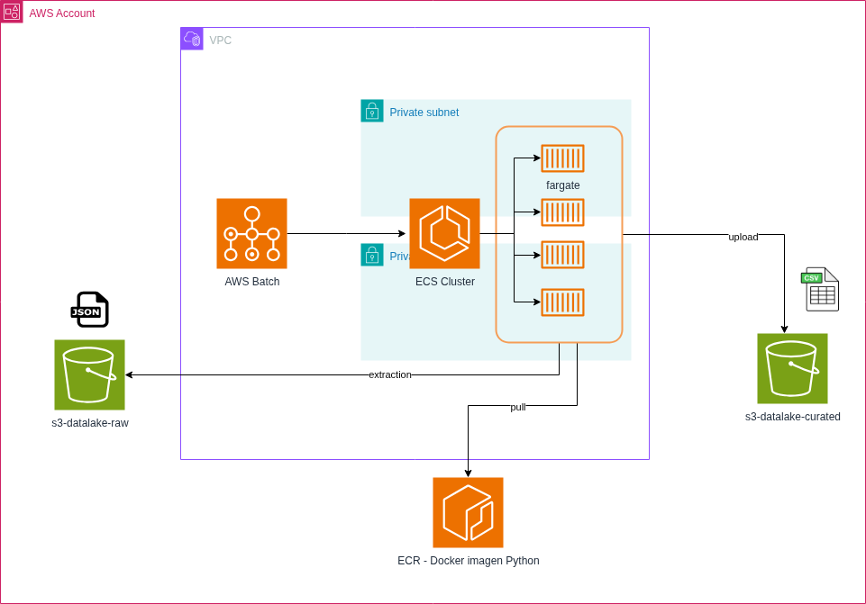

## proyecto ETL con terraform y terragrunt (Batch)


## Configuration policy Bucket S3 and DynamoDB - State file and Lock
```bash
https://terragrunt.gruntwork.io/docs/features/aws-authentication/
```

## Install AWS CLI
```bash
curl "https://awscli.amazonaws.com/awscli-exe-linux-x86_64.zip" -o "awscliv2.zip"
unzip awscliv2.zip
sudo ./aws/install
aws --version
aws sts get-caller-identity
```

## Install git
```bash
sudo apt-get update
sudo apt-get install git
git --version
```
## instalación de opentofu
https://opentofu.org/docs/intro/install/deb/
```bash
# Download the installer script:
curl --proto '=https' --tlsv1.2 -fsSL https://get.opentofu.org/install-opentofu.sh -o install-opentofu.sh
# Alternatively: wget --secure-protocol=TLSv1_2 --https-only https://get.opentofu.org/install-opentofu.sh -O install-opentofu.sh

# Give it execution permissions:
chmod +x install-opentofu.sh

# Please inspect the downloaded script

# Run the installer:
./install-opentofu.sh --install-method deb

# Remove the installer:
rm -f install-opentofu.sh
tofu --version
```
## Install Terragrunt - Linux ubuntu

```bash

wget https://github.com/gruntwork-io/terragrunt/releases/download/v0.71.1/terragrunt_linux_amd64
mv terragrunt_linux_amd64 terragrunt
chmod u+x terragrunt
sudo mv terragrunt /usr/local/bin/terragrunt
terragrunt --version

```


# Terragrunt 

terragrunt init

terragrunt plan 

terragrunt apply -auto-approve

terragrunt output


### cuando tengo varias cuenta de AWS
tienes que ejecutarlo desde la raiz de mi proyecto por ambiente
~/terragrunt_aws_multi_account_example-base/terragrunt-infrastructure/Sandbox$ terragrunt run-all plan


##### para el despliegue en multi account role

terragrunt run-all apply

### para destruir toda la infra
terragrunt run-all destroy

